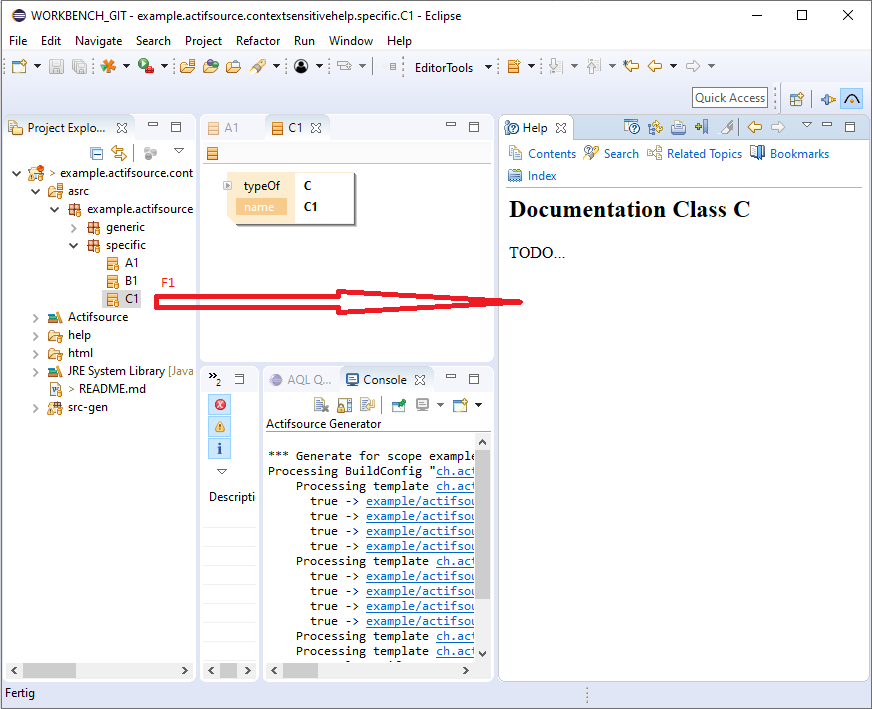
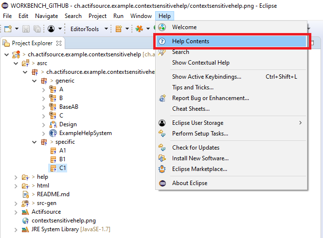
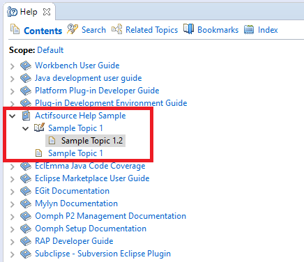

# Context Sensitive Help
In this project we will show how to set up the context sensitive help system. The Actifsource context sensitive help is integrated into the Eclipse Platform help system.

The Example is described in the actifsource user manual [Context Sensitive Help](https://www.actifsource.com/_downloads/ActifsourceManual_ActifsourceUserManual.pdf)

## Requirements
Actifsource Workbench Enterprise Edition

## License
[http://www.actifsource.com/company/license](http://www.actifsource.com/company/license)
